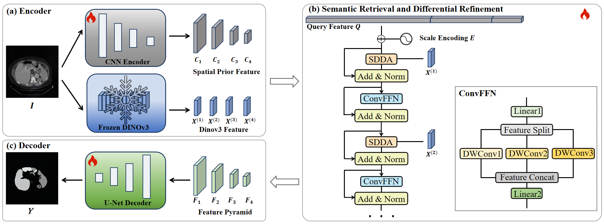

# ReDINO
ReDINO: Structure-Guided Semantic Retrieval and Differential Refinement from Frozen DINOv3 for Medical Image Segmentation

> [!IMPORTANT]
> We propose ReDINO, a structure-guided semantic retrieval and differential refinement framework built upon a frozen DINOv3 backbone. Specifically, a lightweight convolutional branch constructs multi-scale structural priors, which serve as task-aware queries to progressively retrieve and aggregate semantic information from intermediate DINOv3 representations at different depths. To enhance the discriminability of the retrieved features, we introduce Scale-Aware Differential Deformable Attention (SDDA). For convolutional queries at each scale, SDDA employs a primary sampling branch to retrieve and aggregate semantics associated with the queried structures, together with a refinement branch that performs complementary sampling to adaptively correct the primary responses. The two branches are integrated using head-wise differential coefficients.



Clone the DINOv3 repository:

```bash
git clone https://github.com/facebookresearch/dinov3.git
```
